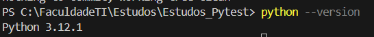
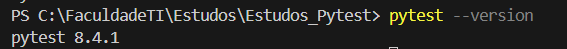

# INTRODUÇÃO PYTEST

## 1. Instalação:
Para instalar o pytest no seu computador, precisamos que o Python esteja instalado no seu computador
Baixe aqui: (Link site oficial do python)

Para verificar se o python foi instalado corretamente, execute o seguinte comando no terminal
```terminal
python --version
```
Se aparecer:



Está tudo Ok!

Após ter o python instalado no seu computador, abra o terminal do seu computador e execute o comando:
```terminal
pip install pytest
```

Para verificar se o pytest foi instalado com sucesso, execute no terminal o seguinte comando:
```terminal
pytest --version
```

Se aparecer:



Está tudo Ok!

Agora que você fez tudo isso, estamos prontos para começar nossos estudos!!! Acompanhe nas próximas aulas (pastas) e bons estudos.